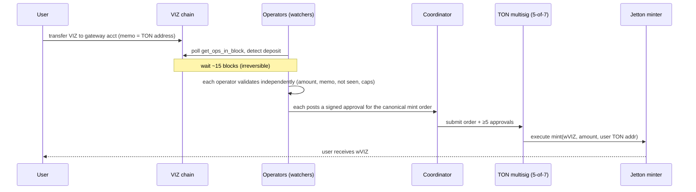

# Secure VIZ ↔ TON Gateway — Research & Implementation Plan

Scope: a bidirectional gateway that locks VIZ on the VIZ blockchain and mints a
wrapped VIZ Jetton on TON (and the reverse), secured by an M-of-N signer
federation that uses the native multisig of *both* chains. Trust model chosen
up front: **federated multisig, lock-and-mint** (not light-client, not atomic
swap). Deliverable also includes a runnable Dockerized TypeScript scaffold in
this repository.

Date: 2026-05-23.

---

## 1. TL;DR (the numbers first)

- **Run the gateway with 7 independent operators using a 5-of-7 threshold on both chains.** This is the BFT-clean point for `f = 2` (`N = 3f+1`, `T = 2f+1`): it tolerates **2 malicious operators and 2 offline operators at the same time**, and an attacker needs **5 of 7 keys** before any theft is possible.
- Draw the 7 operators from the **active VIZ delegates** (the chain already elects and stake-vets up to 21 of them). Incentives align, they already run hardened infrastructure, and the same group secures both ends.
- Use the **same federation on both chains**: the VIZ gateway account's `active` authority is `5-of-7`, and the TON `multisig-contract-v2` that owns the Jetton minter admin is `5-of-7`. Uniform trust surface.
- Lock the VIZ **`master`** authority separately and harder (e.g. 6-of-7 cold keys, plus a `recovery_account`). `master` can rewrite all other keys, so it must never share the hot signing path.
- **Finality before acting:** wait for VIZ irreversibility (~15 blocks ≈ **45 s**, derived from the Graphene 2/3+1 rule — see §6) and TON masterchain finality (~**6 s**, measured) plus a safety buffer.
- **1:1 invariant, continuously reconciled:** `circulating wrapped-VIZ on TON == VIZ locked in the gateway account`. A reconciliation job halts the bridge on any drift.
- Hard caps from day one: per-transfer max, rolling 24 h max, and a global pause switch any single operator can pull (pause is cheap; mint/release is expensive).

If you only take one thing: **7 operators, 5-of-7, same set both chains, delegates as operators, hard caps + a kill switch.**

---

## 2. The two chains, in numbers

| Property | VIZ | TON |
|---|---|---|
| Consensus | DPoS (Graphene) | pBFT-family (validators, 2/3 by stake) |
| Block interval | 3 s | ~3 s (shard), masterchain ~4–5 s |
| Round / schedule | 21 blocks/round = 63 s; 11 top + 10 support witnesses | continuous; 16 voting rounds × ~400 ms |
| Time-to-finality | ~45 s (derived, see §6) | ~6 s (16×400 ms ≈ 6.4 s measured) |
| Signature scheme | secp256k1 / ECDSA | ed25519 |
| Native multisig | Yes — weighted `key_auths` + `account_auths` with a `weight_threshold`, per authority level | Yes — `multisig-contract-v2`, configurable `T`-of-`N`, audited by TON Core |
| Token model | Native `VIZ` asset (3 dp) + `SHARES` | Jetton standard (TEP-74); minter + per-user wallet contracts |
| Protocol-change quorum | 17 of 21 witnesses | 2/3 of validators by stake |
| Client lib (TS/JS) | `viz-js-lib` | `@ton/ton`, `@ton/core`, `@ton/crypto` |

VIZ authority model that we exploit directly (no custom contract needed on the
VIZ side): every account has `master`, `active`, `regular`, and `memo` (comm)
authorities. Each authority is `{ weight_threshold, account_auths[[name,w]],
key_auths[[pubkey,w]] }`. A transfer is an `active`-authority operation. Set the
gateway account's `active` authority to seven keys of weight 1 and
`weight_threshold = 5` and you have a 5-of-7 multisig **enforced by the VIZ
consensus itself** — the chain rejects any transfer that doesn't carry ≥5 of the
7 signatures. There is nothing to deploy and nothing custom to audit on VIZ.

On TON the analogous primitive is `multisig-contract-v2` (parent multisig holds
the owner set + threshold; child "order" contracts accumulate approvals and
execute once `T` is reached). The wrapped token is a **Jetton** built from the
audited `ton-blockchain/stablecoin-contract` (TEP-74 + TEP-89, mintable, has an
admin role). The minter's `admin` is set to the multisig address, so **only a
5-of-7 consensus can mint or burn** wrapped VIZ.

---

## 3. Trust model

### 3.1 Chosen: federated multisig, lock-and-mint

- **VIZ → TON (peg-in):** user sends VIZ to the gateway VIZ account with a memo carrying their TON address. Operators observe the (irreversible) deposit and co-sign a TON multisig order that mints an equal amount of wrapped VIZ (`wVIZ`) to the user.
- **TON → VIZ (peg-out):** user burns `wVIZ` (or sends it to the gateway's Jetton wallet) with a comment carrying their VIZ account name. Operators observe the (final) burn and co-sign a VIZ `transfer` from the gateway account to the user.

Invariant: locked VIZ == circulating wVIZ, 1:1, always.

### 3.2 Why not the alternatives (brief)

- **Trustless light-client bridge.** You would need a VIZ-consensus verifier running inside a TON smart contract and a TON-consensus verifier on VIZ. Neither exists; VIZ is a niche Graphene chain with no on-chain verifier elsewhere, and writing a TVM verifier for Graphene DPoS headers (plus secp256k1 recovery in FunC/Tact) is a multi-quarter research effort with its own audit burden. Not justified for this asset.
- **HTLC / atomic swaps.** No custody and no wrapped token, but it is not a "gateway": it needs a liquidity counterparty online for every swap and per-chain HTLC support, and it doesn't give you a fungible `wVIZ` on TON. Useful later as a *liquidity* layer on top, not as the bridge.

The federated multisig is the only model that ships on today's VIZ + TON
primitives with a bounded, auditable trust assumption (`< T` operators
honest-or-offline). The rest of this document deepens that model.

---

## 4. Architecture

```
                         ┌──────────────────────────────────────────┐
                         │              Operator node k               │
                         │  (one per federation member, 7 total)      │
                         │                                            │
   VIZ full node ───────▶│  viz-watcher ─┐                            │
                         │               ├─▶ validator ─▶ signer (HSM)│
   TON node / API ──────▶│  ton-watcher ─┘                  │  keys   │
                         │                                   │        │
                         └───────────────────────────────────┼────────┘
                                                              │ partial sigs / approvals
                                                              ▼
                                              ┌───────────────────────────┐
                                              │  coordinator (untrusted)   │
                                              │  collects T sigs, assembles│
                                              │  & broadcasts the tx       │
                                              └───────────────────────────┘
                                                  │                  │
                                                  ▼                  ▼
                                             VIZ network         TON network
                                          (gateway active     (multisig-v2 →
                                           5-of-7 transfer)     jetton mint/burn)
```

Peg-in sequence (VIZ → TON):



Peg-out is the mirror image: burn on TON → after TON finality, operators co-sign
a VIZ `transfer` from the gateway account → coordinator broadcasts → user
receives VIZ.

### 4.1 Key design rule — the coordinator is untrusted

The coordinator only shuttles unsigned transactions and collects signatures. It
holds **no keys**. If it is fully compromised it cannot steal funds (it would
need 5 operator keys); it can at worst stall liveness (operators can re-elect or
self-host a coordinator). Every operator independently re-derives the *canonical*
transaction from the source-chain event and signs only that, so signatures from
honest operators aggregate deterministically and a malicious coordinator cannot
get them to sign anything else.

### 4.2 Canonical mapping and idempotency

Each source event maps to exactly one destination action via a deterministic key:

- peg-in key = VIZ `trx_id` (+ op index)
- peg-out key = TON message hash of the burn

Operators persist processed keys. On TON, the order's seqno/nonce prevents
replay; on VIZ, TaPoS (`ref_block_num` + `ref_block_prefix`) and a transaction
expiry bound replay windows. Same key ⇒ same canonical tx ⇒ signatures combine;
a second sighting of the same key is dropped.

---

## 5. How many people — the core security question, with the math

A custody multisig has two opposing failure modes. Let `N` = signers, `T` = threshold.

- **Theft.** An adversary that controls `T` keys can move funds. Tolerated compromised keys before theft is possible = `T − 1`. → want `T` large.
- **Freeze.** If fewer than `T` keys remain usable, funds can't move. Tolerated lost/offline keys before freeze = `N − T`. → want `T` small.

These pull in opposite directions; the job is to pick the point that survives the
most simultaneous faults of *both* kinds. The classic BFT result is `N = 3f + 1`,
`T = 2f + 1`, which tolerates `f` Byzantine **and** `f` crash faults at once.

The table below is generated by `tools/threshold-calc.mjs` (run it yourself):

```
N   threshold   theft-tol  freeze-tol  BFT f (simultaneous)
------------------------------------------------------------
3   2-of-3      1          1           1
4   3-of-4      2          1           1
5   4-of-5      3          1           1
6   4-of-6      3          2           2
7   5-of-7      4          2           2
8   6-of-8      5          2           2
9   6-of-9      5          3           3
10  7-of-10     6          3           3
11  8-of-11     7          3           3
12  8-of-12     7          4           4
13  9-of-13     8          4           4
14  10-of-14    9          4           4
15  10-of-15    9          5           5
```

BFT-clean optima (`N = 3f+1`, `T = 2f+1`):

```
f=1: 3-of-4   tolerates 1 malicious AND 1 offline at once; theft needs 3 keys
f=2: 5-of-7   tolerates 2 malicious AND 2 offline at once; theft needs 5 keys
f=3: 7-of-10  tolerates 3 malicious AND 3 offline at once; theft needs 7 keys
f=4: 9-of-13  tolerates 4 malicious AND 4 offline at once; theft needs 9 keys
```

### 5.1 Recommendation: 7 operators, 5-of-7

- **Theft resistance:** an attacker must compromise **5 distinct, independently-operated keys**. Up to 4 colluding/compromised operators cannot move a single token.
- **Liveness:** the bridge keeps working with **2 operators down** (maintenance, key loss, outage) — exactly the slack a real on-call rotation needs.
- **Simultaneous fault budget `f = 2`:** survives 2 malicious *and* 2 offline together. This is the smallest `N` that gives a genuine `f = 2` guarantee, which keeps coordination and signing latency low.
- **Maps onto VIZ governance:** VIZ runs up to 21 witnesses with a 17/21 protocol quorum. Seven bridge operators is a clean, independently-vetted subset of that delegate set.

Why not fewer: 3-of-4 (`f = 1`) tolerates only one fault of each kind — a single
malicious operator plus a single outage is enough to stall, and only one
compromise away from being one step from theft tolerance limits. Fine for a
testnet, thin for real value.

Why not more: 7-of-10 / 9-of-13 raise theft resistance further but each added
operator is another machine, another key ceremony, another on-call human, and
more signing latency. Scale up **only** when the value locked (TVL) justifies it.
A reasonable policy: **5-of-7 below a TVL ceiling, pre-plan a migration to
7-of-10 above it.**

### 5.2 Two-tier keys on VIZ (important)

The VIZ `master` authority can replace every other key, so it must not sit on the
hot path:

- **`active` authority = 5-of-7 hot** — the everyday signing set that releases VIZ. Keys live in operator HSMs / hardened signer hosts.
- **`master` authority = 6-of-7 cold** (or a separate founders' 3-of-4) — used only to rotate operators or recover. Keys offline, geographically split. Higher threshold because it is rarely used and catastrophic if abused.
- Set `recovery_account` on the gateway VIZ account so a compromised `master` is itself recoverable through VIZ's account-recovery flow.

On TON, signer rotation and threshold changes are governed by the multisig itself
(`update` requires the current `T`-of-`N` consensus), which gives an equivalent
"only the federation can change the federation" property.

### 5.3 Operator independence checklist (what makes the math real)

The `T − 1` theft tolerance is only true if the keys fail *independently*. Make
them independent: distinct legal entities/jurisdictions; distinct cloud/hosting
providers; distinct VIZ and TON node infrastructure per operator (each operator
verifies the source chain itself — never a shared oracle); HSM or hardware-key
custody; and no shared admin credentials. Seven keys on one provider behind one
SSO is a 1-of-1, not a 5-of-7.

---

## 6. Finality, confirmations, reorg handling (numbers)

- **VIZ.** Graphene marks a block irreversible once more than 2/3 of the scheduled witnesses have built on it. For 21 witnesses that is ~15 distinct producers ⇒ **~15 blocks ≈ 45 s**. *This figure is derived from the standard Graphene last-irreversible-block rule; the VIZ docs publish the 3 s/21-block round and the 17/21 protocol quorum but not an explicit confirmation count, so treat 15 blocks as a safe-side derivation and confirm against `last_irreversible_block_num` from the node's `get_dynamic_global_properties` in practice.* The watcher should act on `last_irreversible_block_num`, not a fixed count.
- **TON.** Finality is ~**6 s** (16 voting rounds × ~400 ms ≈ 6.4 s), masterchain block ~4–5 s. Treat a burn as final once the masterchain block referencing it is committed; add a small buffer (e.g. confirm the account/seqno moved and wait one extra masterchain block).
- **Reorg policy:** never sign a destination action for a source event that is not yet final/irreversible. Because we wait for irreversibility on VIZ and masterchain finality on TON, single-chain reorgs cannot cause a double-mint or double-release.

Peg latency the user feels: peg-in ≈ 45–60 s (dominated by VIZ irreversibility) +
signing/coordination; peg-out ≈ 10–20 s (TON finality + buffer) + signing. Both
are fine for a non-HFT gateway.

---

## 7. Threat model and mitigations

| Threat | Mitigation |
|---|---|
| Operator key compromise (< 5) | M-of-N absorbs up to 4; HSM custody; rotate via `master`/multisig consensus |
| Coordinator compromise | Holds no keys; can only stall; operators sign only the canonical tx; coordinator is replaceable |
| Double-mint via reorg | Act only after VIZ irreversibility / TON masterchain finality |
| Replay of a deposit | Idempotency ledger keyed on source `trx_id` / msg hash; TON order seqno; VIZ TaPoS + expiry |
| Forged deposit / fake memo | Each operator independently validates against its *own* full node; never trust a relayer's claim |
| Peg drift (supply ≠ locked) | Continuous reconciliation job; auto-pause on any mismatch beyond dust tolerance |
| Catastrophic exploit / black swan | Per-tx cap, rolling 24 h cap, global kill switch any single operator can trigger; large transfers (> threshold) require manual multi-operator review |
| Insider griefing (withholding sigs) | `N − T = 2` slack keeps liveness; signing SLAs; observable pending-order aging + alerts |
| VIZ `master` abuse | `master` is cold, higher threshold, off the hot path; `recovery_account` set |
| Node/RPC outage | Each operator runs its own VIZ + TON nodes; fall back to multiple public endpoints with cross-checks |

Caps are policy you can tune, but ship with conservative defaults: e.g. per-tx
cap = small multiple of typical transfer; 24 h cap = a few % of TVL; anything
above per-tx cap routes to a manual-review queue that still requires 5-of-7. The
**pause switch is 1-of-N** (any operator can stop the world); **unpause is
T-of-N** (deliberate, consensual restart).

---

## 8. Implementation plan (TypeScript + Docker)

### 8.1 Repository layout (monorepo, npm workspaces)

```
viz-ton-gateway/
├─ package.json                # workspaces root
├─ tsconfig.base.json
├─ docker-compose.yml          # one full operator node (watchers + signer)
├─ docker-compose.coordinator.yml
├─ .env.example
├─ tools/
│  └─ threshold-calc.mjs       # the §5 numbers, runnable
├─ packages/
│  ├─ common/                  # types, config, canonical encoding, idempotency, caps
│  ├─ viz-watcher/             # viz-js-lib: poll blocks, detect gateway deposits/releases
│  ├─ ton-watcher/             # @ton/ton: detect burns / mints, read finality
│  ├─ signer/                  # per-operator: validate event → sign VIZ partial / approve TON order
│  ├─ coordinator/             # untrusted: collect T sigs, assemble + broadcast
│  └─ recon/                   # supply vs locked reconciliation + auto-pause
└─ contracts-ton/              # jetton minter (from stablecoin-contract) + multisig-v2 deploy scripts
```

The accompanying scaffold in this repo implements the structure above with
working stubs: typed config, the canonical-tx + idempotency core, watcher poll
loops, a signer service skeleton (key handling abstracted behind an interface so
HSMs drop in), a coordinator that enforces the threshold, a reconciliation loop,
multi-stage Dockerfiles, and `docker-compose` for a complete operator node.

### 8.2 Components

- **common** — shared `GatewayConfig` (chain endpoints, gateway addresses, threshold, caps), the `IdempotencyStore` interface (SQLite/Postgres), `canonicalPegIn`/`canonicalPegOut` (deterministic destination-tx builders), and cap/circuit-breaker logic. This is the trust-critical code; keep it small and audited.
- **viz-watcher** — uses `viz-js-lib` to follow blocks (`get_ops_in_block`) and the irreversible head (`get_dynamic_global_properties.last_irreversible_block_num`); emits `Deposit` (peg-in) and `ReleaseConfirmed` events.
- **ton-watcher** — uses `@ton/ton` (toncenter/liteclient/TON Access) to follow the Jetton minter + gateway Jetton wallet; emits `Burn` (peg-out) and `MintConfirmed`.
- **signer** — the only component with keys. Validates an event independently against its own nodes + caps + idempotency, then produces either a VIZ partial signature (secp256k1) or a TON multisig approval (ed25519). Keys behind a `Signer` interface: file-backed for dev, HSM/KMS for prod.
- **coordinator** — keyless. Holds the canonical tx, collects approvals, broadcasts once `T` reached. Stateless w.r.t. trust; can be self-hosted by any operator.
- **recon** — recomputes `wVIZ totalSupply` vs `gateway VIZ balance` every N seconds; trips the global pause on drift.
- **contracts-ton** — deploy/init scripts for `multisig-contract-v2` (set 7 signers, threshold 5) and the Jetton minter (`stablecoin-contract`, admin = multisig address).

### 8.3 Phased delivery

1. **Phase 0 — design freeze & key ceremony plan (1–2 wks).** Finalize 7 operators, jurisdictions, HSM choice, cap policy. Write the key-generation ceremony.
2. **Phase 1 — testnet, single direction (2–3 wks).** VIZ→TON peg-in on VIZ testnet + TON testnet. 5-of-7 multisig live. No caps yet.
3. **Phase 2 — bidirectional + reconciliation (2–3 wks).** Add peg-out, the recon loop, idempotency persistence, caps + pause/unpause.
4. **Phase 3 — hardening (2–4 wks).** HSM integration, monitoring/alerting, chaos tests (kill operators, force reorgs on testnet), runbooks.
5. **Phase 4 — external audit (parallel, 3–6 wks).** Audit `common` (canonical mapping, idempotency, caps) and the TON contract setup. The VIZ side needs no custom contract, which shrinks the audit surface.
6. **Phase 5 — guarded mainnet launch.** Low TVL ceiling, low caps, manual review of large transfers, daily reconciliation reports. Raise caps as confidence grows.

### 8.4 Sharing with trusted people (the Docker story)

Each operator clones the repo, drops their secrets into `.env` (their own VIZ
key + TON signer key, never shared), and runs `docker compose up`. That starts
their watchers + signer as a self-contained operator node. The only shared,
public configuration is the federation manifest (the 7 public keys, gateway
addresses, threshold, caps) committed to the repo — so onboarding a trusted
operator is "clone, set two secrets, compose up." The coordinator ships as a
separate compose file so any operator can run it.

---

## 9. Other suggestions

- **Make the 1:1 proof public.** Publish a read-only "proof-of-reserves" endpoint/page that shows live `locked VIZ` vs `wVIZ supply`. It is cheap (the recon job already computes it) and it is the single most trust-building artifact you can give users. This is a natural fit for a live, re-openable dashboard.
- **Fee policy.** Charge a small bps fee on peg-in/peg-out to fund operator infrastructure and an insurance reserve, rather than relying on goodwill. Decide whether fees accrue in VIZ (held) or wVIZ (burned/treasury).
- **Telegram-native UX.** TON is Telegram-native and you already build Telegram bots — a Telegram Mini App / bot front-end for "send VIZ, get wVIZ" is the obvious low-friction entry point and plays to existing strengths. Keep the bot a *thin* client over the same public endpoints; it must hold no keys and have no privileged path.
- **Don't over-trust public RPC.** For both chains, run your own nodes per operator and treat public endpoints as cross-check only. A bridge that depends on one public RPC has silently centralized its security.
- **Emergency drills.** Rehearse the kill switch, an operator key rotation, and a recon-triggered pause on testnet before mainnet. The first time you exercise the `master` recovery path should not be during an incident.
- **Wrapped-token metadata & naming.** Make the Jetton metadata explicit that `wVIZ` is a bridge claim on VIZ, with a link to the proof-of-reserves and the operator manifest. Avoid implying it is native TON value.
- **Governance for the operator set.** Since operators map to VIZ delegates, define on-chain-aligned rules for adding/removing operators (e.g. tied to delegate standing) so the human trust model has the same legitimacy as the chain's.
- **Atomic-swap liquidity later.** If you ever want trust-minimized large transfers, an HTLC liquidity layer can sit *on top* of the wrapped token for users who don't want custody exposure — but it is an enhancement, not the foundation.

---

## 10. Open items to verify before mainnet

- **VIZ exact irreversibility count. [MEASURED].** Sampled on `https://node.viz.cx`: `head - last_irreversible_block_num` held steady at **14 blocks (~42 s)** — close to the ~15-block derivation. The wired watcher acts on `last_irreversible_block_num` minus a configurable safety margin (`VIZ_EXTRA_CONFIRMATIONS`, default 2), so it self-adjusts if the lag moves.
- **viz-js-lib multisig signing path. [RESOLVED — see `tools/viz-multisig-spike.cjs`].** Verified: `auth.signTransaction(trx, keys)` signs a deterministic `chain_id + toBuffer(trx)` buffer and *appends* to `trx.signatures`. Signing is canonical/deterministic, and each operator's independently-produced signature is byte-identical to the one it would produce in a group signing — so operators sign in isolation and a keyless coordinator simply concatenates. The signature also binds to tx content (changing the amount changes the signature), so a malicious coordinator cannot swap the action under collected signatures. **One gotcha:** the returned `signatures` array is *unordered* (the library returned a rotated order); treat it as a set, never rely on position. The fallback (raw-transaction signing) is therefore not needed.
- **TON multisig-v2 + jetton admin handoff. [SCRIPTS READY].** Deploy scripts exist in `contracts-ton/` (`deploy:multisig`, `deploy:minter`, `set-minter-admin`), dry-run-verified offline (metadata, init data, address calc, change_admin body, wallet derivation). Remaining: build the audited bytecode via Blueprint, deploy on testnet, and confirm the `stablecoin-contract` admin transfers to the multisig and mint/burn execute. The scripts deploy operator-supplied audited bytecode — they do not re-implement the contracts.
- **TON finality buffer. [PARTIAL].** The wired `TonHttpChain` currently treats a burn as final using a *time* buffer derived from `TON_FINALITY_CONFIRMATIONS` (~5 s/masterchain block + margin). Refinement: gate precisely on masterchain block depth (map seqno → logical time) rather than wall-clock; measure on testnet. Live reads (seqno, jetton supply) and the `transfer_notification` parser are verified.
- **Cap calibration.** Set per-tx / 24 h caps against realistic volume once you have it.

---

## 11. Validator-run federation (dynamic TOP-11)

A natural way to run this gateway is to let VIZ's existing **TOP-11 witnesses**
(the eleven top-voted delegates, the stable core of the 21-slot round) be the
federation operators. They already run hardened infrastructure, are continuously
elected by stake, and are penalized for downtime — exactly the properties a
signer set wants. This section refines the design for that model.

### 11.1 The structural shift it introduces

With a hand-picked federation, custody security is "these N specific entities
won't collude." Binding the set to TOP-11 makes custody security **≤ the cost to
acquire enough VIZ stake-votes to seat a colluding majority of top witnesses.**
You have coupled bridge custody to VIZ's stake-voting security. That is a
reasonable assumption — it is the same trust users already place in VIZ
consensus — but it must be *priced and bounded*, because vote distributions shift
and stake can sometimes be acquired faster than a curated set can be compromised.
Everything below exists to bound that.

### 11.2 VIZ side — registration + heartbeat are free, and a good idea

VIZ `custom`-type operations are bandwidth-funded; TOP-11 witnesses have large
effective stake, so these messages cost effectively nothing in token terms. Use
two:

- **Registration** — `{type: gateway_register, ton_signer_pubkey, endpoint, version}`. This makes the VIZ chain the authoritative, auditable registry of *who runs the gateway* and *which TON ed25519 key* each validator signs with. The TON signer set is derived from this registry.
- **Heartbeat / attestation** (every 5–10 min) — not just "online", but `{ts, last_viz_block, last_ton_seqno, locked_viz, wviz_supply, version}`. This turns liveness into a *decentralized proof-of-reserves cross-check*: if validators' attested `locked_viz` / `wviz_supply` diverge, that is an early theft/bug signal independent of the `recon` job.

For the VIZ custody itself, use the chain's native authority model rather than
separate keys: set the gateway account's `active` authority to `account_auths`
of the 11 witness accounts (each weight 1, threshold 7). Validators then sign
releases with their *own* account keys. Keep the two tiers: `active` = the
rotating TOP-11; `master` = a small, stable **guardian** multisig used only to
rotate the active set and to pause.

Caveat to verify: VIZ's permission table places "replacement of all keys" under
**Master**, implying authority changes are a master-key action — so each VIZ-side
rotation is performed by the guardian (still free, but it needs the guardian, not
the active set itself). Confirm the exact `account_update` requirement in
`viz-cpp-node`; it decides whether the active set can rotate itself or the
guardian gates every rotation.

### 11.3 TON side — the crux

TON is where the VIZ/TON asymmetry bites:

- **Static multisig vs dynamic set.** `multisig-contract-v2` has a *fixed* signer set, changeable only by an `update` order approved by the *current* T-of-N. You cannot "just track TOP-11" — you reflect each change with an update order, which costs gas and has latency.
- **No heartbeats on TON — and you don't want them.** Liveness stays a VIZ-only, free concern. TON is touched only on *events*: mint executions (per peg-in) and the occasional membership `update`. With rare rotations (below), TON cost is dominated by mints, not liveness.
- **The incumbent-approval gate is a feature.** Adding a signer needs the *current* signers to approve, so a VIZ vote-capture does **not** automatically capture the TON multisig — incumbents gate entry. The risk only materializes if the operating policy is "blindly rotate to whatever TOP-11 says." So rotation must be deliberate, not automatic; the update order is the natural checkpoint to apply anti-capture policy.
- **Gas funding.** Unlike VIZ, TON ops cost toncoin. Fund the multisig + a small gas wallet from a **bridge fee** (a few bps on peg-in/out, accrued/swapped to TON). Validators do not each pay TON gas.
- **Threshold.** Run **7-of-11** rather than 8-of-11: it tolerates 4 simultaneous malicious *and* 4 offline (theft still needs 7 colluding), and gateway-signer uptime ≠ block-production uptime (the signer service can be down while the witness still produces blocks). Move to 8-of-11 only after measuring high signer uptime. Limitation: multisig-v2 uses *one* threshold for all orders, so a membership change has the same bar as a mint — to raise that bar you need the guardian to co-gate updates or a higher overall T (which costs liveness).

### 11.4 Rotation policy (anti-capture)

- **Seasoning**: a witness must hold TOP-11 continuously for, e.g., 7 days before being *added* as a TON signer; *removal* is immediate. Asymmetric: slow to grant power, fast to revoke.
- **Rate-limit**: at most one signer change per epoch, so a flash vote-swarm cannot swap the set in a single block.
- **Tolerate, don't churn**: brief signer outages are absorbed by the threshold's freeze tolerance (4 with 7-of-11), not by an immediate, gas-costly rotation. Rotate on *vote-driven* TOP-11 change or prolonged outage, not on every blip.

### 11.5 Bounding the coupled risk

Assume capture is *possible* and make it *bounded and slow*:

- **Caps** (per-tx + rolling 24h) so a captured set cannot drain instantly — at most one cap-window before recon/attestations fire.
- **Guardian pause key** — a pause-*only* power (halts mint/release, cannot move funds). Concentrating *pause* is safe; concentrating *spend* is not. This is the circuit breaker against an in-progress capture.
- **Seasoning + rate-limit** so capture needs sustained, not flash, vote control.
- **Monitor the attack cost** — track the VIZ stake/vote concentration required to seat 6+ colluding top witnesses and keep caps sized below that cost. If a majority is cheaper than the value locked, lower caps or tighten the set.

### 11.6 Recommendation

Run as TOP-11, but: VIZ custody via native `account_auths` (validators sign with
their own keys) + a guardian master; TON custody via a 7-of-11 multisig-v2 whose
signer set is *derived from the VIZ on-chain registry* and synced by deliberate,
seasoned, rate-limited `update` orders; heartbeats/attestations free on VIZ, none
on TON; gas + caps + guardian-pause as the safety envelope. This keeps the
elegant "validators run it and announce it on VIZ for free" model while making
the TON side event-driven and capture-resistant.

Implied components to build: a VIZ `registry`/`heartbeat` module (publish + read
the signer registry and attestations) and a `syncer` service that watches TOP-11
+ the registry and proposes the seasoned, rate-limited TON multisig `update`
orders.

### 11.7 Guardian master — 3-of-4 (extreme-case recovery only)

The gateway VIZ account's `master` authority is a small, fixed guardian council:
**3-of-4** of `[on1x, lex, id, denis-skripnik]`. It is never on the operational
path — it exists only to rotate the active set or to recover access if things go
wrong. 3-of-4 stays convenable in a crisis (tolerates one guardian unreachable)
while requiring three independent reputable validators to act (no single/double
point).

Be clear-eyed about the trust this places: on VIZ, `master` can do everything
`active` can (replace keys *and* move assets), so it is strictly more powerful
than the 7-of-11 active set, and **application-level caps do not constrain a
master-signed transfer** (those run in the gateway software; a raw master tx
bypasses it). With a 4-person council the master quorum (3) is by construction an
easier path than 7-of-11, so it is the bridge's theft floor. That is an accepted
trade for recoverability, anchored on: these specific reputable validators not
having three collude; **cold/hardware key custody** for all four; the built-in
VIZ rule that master keys change at most **once per hour**; a set
**`recovery_account`** (a separate conservative account that can restore control
if `master` is maliciously changed, within VIZ's owner-recovery window — though
it cannot claw back already-transferred funds); and **monitoring/alerting** so
any master action is seen immediately.

The account's authority object (config, not gateway code):

```
active_authority:  { weight_threshold: <op>, account_auths: [<operational set>] }
master_authority:  { weight_threshold: 3, account_auths: [
                       [denis-skripnik,1], [id,1], [lex,1], [on1x,1] ] }   # sorted (canonical)
regular_authority: = active
recovery_account:  <separate conservative account>
```

This is applied once by the one-time `setup-viz` utility (`npm run
setup:viz-account`, dry-run by default; `APPLY=1` + the current master key to
broadcast). It signs an `account_update` with the current master key and,
optionally, `change_recovery_account`. The utility is not imported by the
running gateway.

## 12. Sources

- VIZ accounts, authorities & multisig: https://docs.viz.cx/accounts.html
- VIZ witnesses / DPoS / rounds / 17-of-21 quorum: https://docs.viz.cx/witnesses.html
- VIZ docs home: https://docs.viz.cx/
- viz-js-lib: https://github.com/VIZ-Blockchain/viz-js-lib  •  https://www.npmjs.com/package/viz-js-lib
- TON multisig v2: https://github.com/ton-blockchain/multisig-contract-v2  •  https://multisig.ton.org/
- TON multisig v2 technical breakdown: https://medium.com/tonx-lab/how-multisig-works-on-ton-a-technical-breakdown-of-multisig-v2-smart-contracts-8cac6477ee9b
- TON wallet/multisig comparison: https://docs.ton.org/v3/documentation/smart-contracts/contracts-specs/wallet-contracts
- TON stablecoin (mintable Jetton, TEP-74/89): https://github.com/ton-blockchain/stablecoin-contract
- TON Jetton minter reference: https://github.com/ton-blockchain/minter-contract
- Developing Jettons (TypeScript wrappers): https://docs.chainstack.com/docs/ton-how-to-develop-fungible-tokens-jettons
- TON consensus & finality: https://medium.com/pharos-production/comparing-blockchain-consensuses-ethereum-solana-ton-part-2-ton-a96f42753dce
